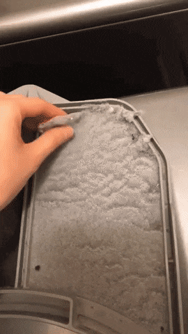
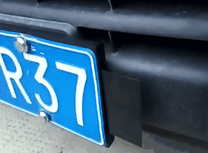
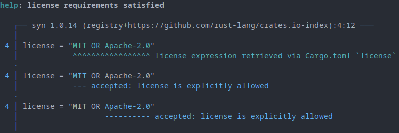
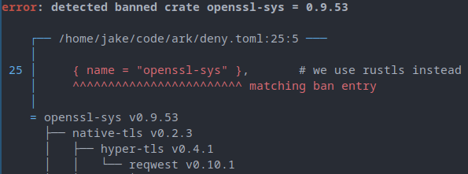
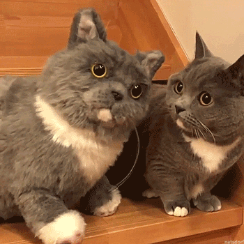
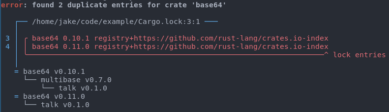
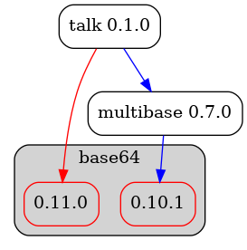
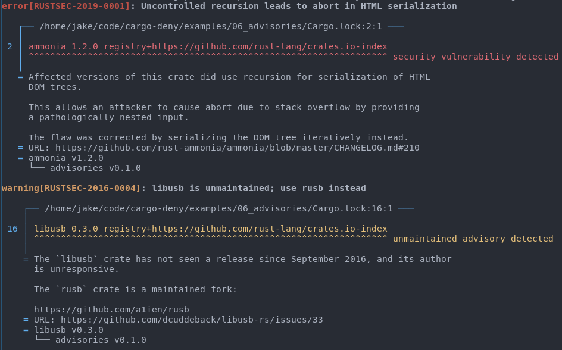

## cargo-deny

---

### Contents

- The ~Problem~ Situation
- Basic Idea of cargo-deny

---

### About

- Game Developer for 13 years
- Edge of Reality (midd️ling) ☠️
- Vigil Games (middling) ☠️ (also THQ ☠️)
- DICE/Frostbite (huge) 🖐
- Embark Studios (small, but fierce) 🦀

---

### The Situation

_of our own making_

----

#### Gamedev (generally)

- Huge, monorepo-style codebases
- Minimal external dependencies, vendored
- Very little interaction with OSS

Note: No external dependencies, no worries? Old, stale code. Inability to drive direction. NIH.

----

#### Crate Ecosystem

- A big reason why many use Rust
- Large (35k+) and growing fast
- Huge spectrum on lots of axes

Note: The crate ecosystem is a huge reason we use Rust.

----

#### How We Work

- Use a "lot" of external dependencies (400+)
- Tend to keep all of them up to date
- Never vendor (but sometimes fork)

Note: We have been pretty good about breaking our old habits.

----

#### Update Often + Evolving Ecosystem = 😕

- Manual inspection is **tedious**
- Some things are outside Cargo's domain
- Maintain cadence over a long time

Note: Manual inspection gets old. Rust and Cargo do a lot of heavy lifting, but they don't handle certain things for good reasons.

---

### cargo-deny



----

#### What to check?

- Licenses
- Bans
- Duplicates
- Advisories
- Sources

----

#### Lint our crate graphs?

- Treat crate graphs like code
- Configure expectations
- Automatically verify expectations

---

### Licenses



----

#### I am not a lawyer

Crates (usually) specify their license terms

```ini
[package]
name = "krates"
version = "0.1.0"
authors = ["Embark <opensource@embark-studios.com>"]
edition = "2018"
license = "MIT OR Apache-2.0" # SPDX license expression
# license-file = "LICENSE" # File with license text
```

Note: Cargo just exposes the metadata if the package supplies it, but that's about it

----

#### Still not a lawyer

- Do all the crates we use have acceptable licenses?
- How do we ensure that holds true over time?
  - New crates
  - Crates that change their licensing

----

#### Configure

- What licenses do we accept/reject?
- Copyleft? OSI Approved/FSF Free? Unlicensed?

```ini
[licenses]
unlicensed = "deny"
copyleft = "deny"
allow = [
    "Apache-2.0",
    "Apache-2.0 WITH LLVM-exception",
    "BSD-2-Clause",
    "BSD-3-Clause",
    "MIT",
]
exceptions = [
    { allow = ["Zlib"], name = "adler32" },
]
```

----

#### Evaluate



Note: We parse and evaluate the SPDX license expression, using the configuration to determine the status of each license term in the expression.

----

#### Caveats

- At the moment uses only 2 sources of input
  - `license` field
  - LICENSE(-*)? files in crate root
- Relies on crate maintainers accurately stating license
  - We have found this to be...not true for many crates using C
- Also, as you know, we're not lawyers

---

### Bans


----

#### It's OK to say no

- Not all crates will "fit" with your project
- Once a crate is removed, keep it out

----

#### Example: OpenSSL

- Often the `default` for crates doing TLS
- System dependencies are annoying (especially on Windows)
- "Better", leaner alternatives

----

#### Configure

```ini
[bans]
deny = [
    { name = "openssl" },     # we use rustls instead
    { name = "openssl-sys" }, # we use rustls instead
]
```

----

#### Evaluate

```diff
 [dependencies.reqwest]
 version = "0.10.1"
-default-features = false
 features = ["json", "rustls-tls"]
```



---

### Duplicates



----

#### Cargo's Tradeoff

- Dependency resolution is hard. As in NP-hard.
- Cargo decided to avoid the problem


----

#### Pros ➕

- Fast
- Easy, particularly for new people
- Ecosystem can evolve at differing paces

Note: Since the ecosystem can evolve at different paces, this implicitly means
that with enough dependencies, duplicates are essentially inevitable.

----

#### Cons ➖

- More crates to download
- More crates to compile & link
- Larger outputs

```bash
error[E0308]: mismatched types
    ...
   = note: expected type `X` (struct `X`)
              found type `X` (struct `X`)
note: Perhaps two different versions of crate `thing` are being used?
```

----

#### cargo-deny duplicate handling

- allow/warn/deny duplicates in a project
- Give concise inclusion graph for each version
- Allow temporary skipping of certain versions

----

#### Configuration

```ini
[bans]
multiple-versions = "deny"
skip = [
    # clap uses an older version of ansi_term
    { name = "ansi_term", version = "=0.11.0" },
}
skip-tree = [
    # ignore winit as it pulls in tons of older crates
    { name = "winit", version = "=0.19" },
]
```

----

#### Command Output



----

#### Graph Output w/ `-g`



----

#### "Real" Graph Output


----

#### Decision Time

- Do we care?
- Should we open a PR?
- Change our own versions to match?
- Remove/replace one or more crates?

----

> Duplicate detection isn't about saying duplicates are bad, it's about surfacing them so you can decide yourself

---

### Advisories


----

#### Built On Top of rustsec

- Made by people who know what they're doing
- Same core functionality used by `cargo-audit`
- Allows for **shared** knowledge

----

#### Not just vulnerabilities

- Also has advisories for ummaintained crates
- Detects crate versions that have been yanked
- More in the future?

----

#### Configuration

```ini
[advisories]
vulnerability = "deny"
unmaintained = "deny"
yanked = "deny"
ignore = [
    # spin is unmaintained, but it has a couple of heavy
    # users, particularly lazy_static, which means it
    # will take a while to ripple out into into all its users
    "RUSTSEC-2019-0031",
]
```

----



---

