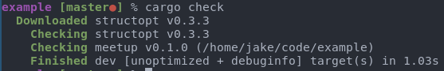
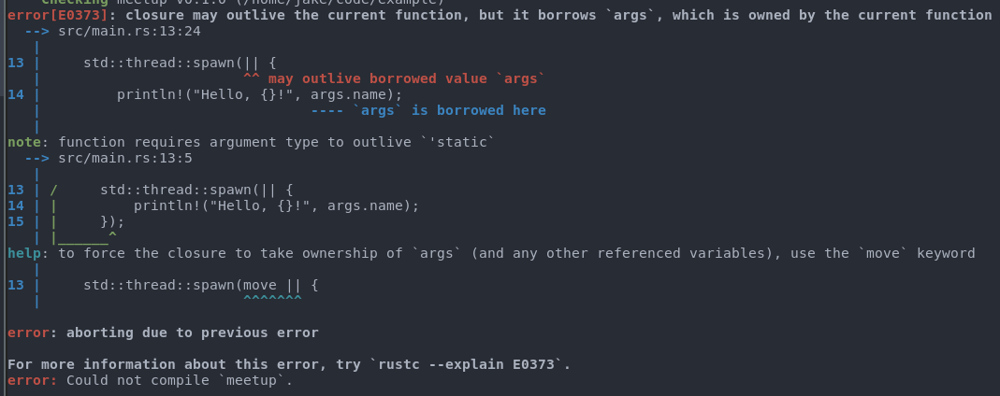
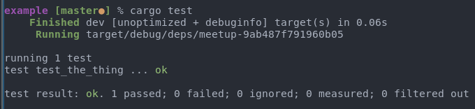
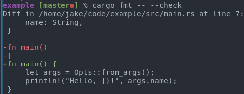
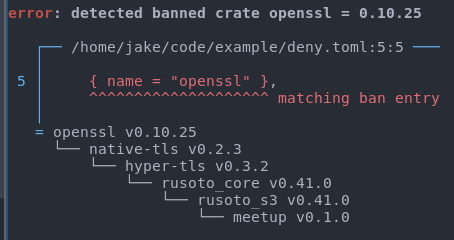
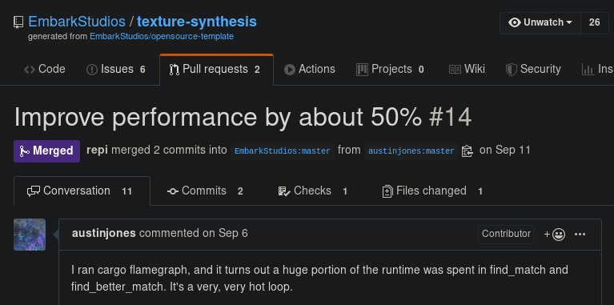

## Rust, Open Source, Gamedev

----

### Contents

- Gamedev Overview
- Why Rust?
- Using Open Source
- Using Hurdles
- Collaborating On Open Source
- Collaboration Hurdles

---

### About

- Game Developer for 12+ years
- Edge of Reality (midd️ling) ☠️
- Vigil Games (middling) ☠️ (also THQ ☠️)
- DICE/Frostbite (huge) 🖐
- Embark Studios (small, but fierce) 🦀

----

### Disclaimer

- Opinions based on my experience
- General view of gamedev, but not total

---

## Gamedev


----

### Pieces

- Engine
- Tools
- Game
- Server*
- Services*


----

#### Engine

- Reusable components eg physics, rendering
- Wrappers on top of platform APIs
- Middleware integrations
- Occasional user of open source eg. compression


----

#### Tools

- Predominantly centered around content pipelines
- Often mixture of languages, C++/C#/Python etc
- Usually **Windows** specific
- Frequent user of open source


----

#### Game

- Bespoke code specific to a single game
- Infrequent user of open source


----

#### Summary

- Most games use open source
- Most games are built with open source
- Most games and associated software are closed

---

## Why Rust?


----

### A Word From Our CTO

> ... combined with the openness and collaborative nature of the quickly growing ecosystem of and around Rust with crates.io and the tens of thousands of open source crates with a best-in-class package system, cargo, truly makes Rust a [language for the next 40 years](https://www.youtube.com/watch?v=A3AdN7U24iU).

----

### [Rust + Open Source](https://embark.dev) = ♥️

- Easier to use
- Easier to make open
- Easier to collaborate

----

### Quick Aside

<blockquote class="twitter-tweet"><p lang="en" dir="ltr">Telling a programmer there&#39;s already a library to do X is like telling a songwriter there&#39;s already a song about love</p>&mdash; Pete Cordell #NoDealNoWay (@petecordell) <a href="https://twitter.com/petecordell/status/428542622844477441?ref_src=twsrc%5Etfw">January 29, 2014</a></blockquote> <script async src="https://platform.twitter.com/widgets.js" charset="utf-8"></script>

Note: Of course programmers want to make stuff, and that's great...but I've also encountered 2 custom in-house scripting languages. Possibly not the best use of engineering effort.

---

## Using Open Source


----

### Downloading - C/C++

- Likely vendored into private VCS
- Often breaks connection with original


Note: Vendoring automatically makes upstream contributions less likely.

----

### Downloading - 🦀

```toml
package]
name = "meetup"
version = "0.1.0"
edition = "2018"

[dependencies]
structopt = "0.3.3" # <- This line
```



----

### Also has Vendoring 😉


Note: Valid use case in some instances, but by no means the default.

----

### Building - C/C++

- Port it to your build system
- Fix unnecessary Linuxisms 🐧
- Fix MSVC warnings
- Fixup syscalls for proprietary platforms*

Note: C/C++ OS libraries tend to be built and maintained by Linux programmers, which inevitably leads to problems on Windows/MSVC.

----

### Building - 🦀

```toml
package]
name = "meetup"
version = "0.1.0"
edition = "2018"

[dependencies]
structopt = "0.3.3" # <- This line
```


----

### Integrating - C/C++

- C++ is a monstrously complicated language
- Most codebases have their own `std` library
- Wrap to limit catastrophic usage


----

### Integrating - 🦀

- "Small" consistent language
- Traits: `From`, `Into`, `AsRef`, `Debug`...
- Code generation, macros, strong `std`...

----

```rust
use structopt::StructOpt;

#[derive(Debug, StructOpt)]
struct Opts {
    /// The name to say hello to
    #[structopt(long, short, default_value = "world")]
    name: String,
}

fn main() {
    let args = Opts::from_args();
    println!("Hello, {}!", args.name);
}
```


---

## Hurdles for Using


----

### Licensing

- External code = suspicious
- GPL in your game means everyone has a bad day


----

#### Licensing - C/C++

- Company dependent process
- Usually manual, slow
- Lack of trust

Note: It is generally so painful to integrate a C/C++ library that a manual approval process is less of a burden than one would assume.

----

#### Licensing - 🦀

Can specify license requirements in crate metadata...

```toml
[package]
name = "meetup"
version = "0.1.0"
edition = "2018"
license = "MIT OR BSD-2-Clause"
license-file = "LICENSE"
```

----

#### + cargo-deny

- Our dependency gardening tool, [open source](https://github.com/EmbarkStudios/cargo-deny)
- Ensures a crate's license requirements
- Keeps certain crates out of your graph
- Detects duplicates


----

```toml
[licenses]
unlicensed = "deny"
allow = [
    #"Apache-2.0",
    #"BSD-2-Clause",
    #"MIT",
]
```


----

### Finance

- Easier to buy/license than use open source library/product
- Papertrail, Support, Legal, etc

----

### Open Problem in Open Source

- Many options
- Inconsistent
- **Hard**


Note: Monetary support is required for the long term growth and stability of the Rust ecosystem, and we want to work with other companies and individuals to figure out how best to do that.

----

### [Earlier today...](https://twitter.com/EmbarkStudios/status/1186964782844469248)


---

## Open Collaboration


----

### Portability - C/C++

- At least 3 major toolchains
- Updating C++ revisions is..controversial
- Countless build systems


Note: Arbitrarily limit supported targets, single header libraries, "best/no effort" support for Windows, which is a problem for gamedevs who primarily work on Windows.

----

### Portability - 🦀

- One Build System to Build Them All*
- One Compiler to Compile Them All*
- cargo -> rustc -> linker -> success*


Note: I hope Rust never gets a separate compiler/cargo/etc. The reason for all the asterisks is actually because of cargo's ability to build C/C++ code from a build.rs in a crate, which brings in many of the same problems as if Rust wasn't invovlved. But it's still easier to use a C library via Rust than in C/C++.

----

### Code Quality - C/C++

- Wildy varying opinions due to size of C++
- "Safe"? "Thread safe"? `¯\_(ツ)_/¯`
- Uneven tooling

Note: Extremely hard to reason about changes due to complexity of language and unsafety. Most game companies have some kind of "code guidelines" wiki page where style, performance, safety, readability, etc concerns are laid out in a document that programmers need to read and internalize.

----

### Code Quality - 🦀

- Language Guarantees
- Reduce friction
- Tools Are Your Friend

----

#### Language Guarantees

PR#1 - Move print to another thread, way faster

```diff
diff --git a/src/main.rs b/src/main.rs
index 217cadc..daf4af5 100644
--- a/src/main.rs
+++ b/src/main.rs
@@ -9,5 +9,8 @@ struct Opts {
 
 fn main() {
     let args = Opts::from_args();
-    println!("Hello, {}!", args.name);
+
+    std::thread::spawn(|| {
+        println!("Hello, {}!", args.name);
+    });
 }
```

----

#### Also broken 💩



----

#### Tests

```rust
fn make_awesome(s: &str) -> String {
    format!("{}!", s)
}

#[test]
fn test_the_thing() {
    assert_eq!(make_awesome("input"), "input!");
}
```



Note: Barebones, but built-in and effective.

----

#### Other Friction Reducers

- Docs, with compile checks!
- [docs.rs](https://docs.rs)!
- Benchmarks
- Too many awesome things to talk about


Note: Property based testing! Criterion! Fuzzers!

----

#### [rustfmt](https://github.com/rust-lang/rustfmt)

Because arguing about code style is lame.



```yaml
- run: rustup component add rustfmt
- name: check rustfmt
  uses: actions-rs/cargo@v1
  with:
    command: fmt
    args: -- --check --color always
```

----

#### [clippy](https://github.com/rust-lang/rust-clippy)

A linter and a teaching tool


```yaml
- run: rustup component add clippy
- name: cargo clippy
  uses: actions-rs/cargo@v1
  with:
    command: clippy
    args: --lib --tests -- -D warnings
```

----

#### [cargo-deny](https://github.com/EmbarkStudios/cargo-deny)

We tend to avoid OpenSSL when possible.



```toml
[bans]
multiple-versions = "deny"
deny = [
    { name = "openssl" },
]
```

---

## Hurdles for Collaboration


----

### Collaboration Is Hard

- Using open source is the easy part
- Open sourcing your own stuff is hard
- Contributing to others' code is even harder


----

### Zero/Negative Sum

- Waste of Effort
- Needs "Business case"
- Best. Code. Ever.

----

### Disagree

- Harder? Absolutely!
- Worth it? [Often](https://github.com/EmbarkStudios/texture-synthesis/pull/14)!



---

## Summary


----

## Stats

- Using ~411 crates in our main Rust project
- Have [open sourced](https://embark.dev/) 9+ crates so far
- Have contributed to dozens of crates
- Helping sponsor and fund several projects/people

----

## Conclusion

- Rust simplifies using and contributing to OS
- Open source is one of Rust's selling points
- Gamedev + Rust + Open Source = Fantastic
- (Or even just [Gamedev and Open Source](https://medium.com/embarkstudios/itering-faster-with-open-source-76ae68f98745))

----


