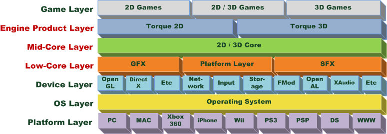

## Rust, Open Source, Gamedev

----


---

## About

- Game Developer for 12+ years
- Edge of Reality (midd️ling) ☠️
- Vigil Games (middling) ☠️ (also THQ ☠️)
- DICE/Frostbite (huge) 🖐
- Embark Studios (small, but fierce) 🦀

---

## Gamedev 🔺


----

### Pieces

- Engine
- Tools
- Game
- Server*
- Services*



----

#### Engine - Closed

- Reusable components eg physics, rendering
- Wrappers on top of platform APIs
- Probably uses some open source libraries


----

#### Tools - Closed

- Predominantly centered around content pipelines
- Often mixture of languages, C++/C#/Python etc
- Almost certainly uses open source software


----

#### Game - Closed

- Bespoke code specific to a single game
- Less likely to contain open source libraries


----

#### Summary

- All games contain or use open source software
- Most games and associated software are closed
- ...but usage of open source is actually quite low

---

## Why OSS is rarely used


----

### Boring Reasons


----

#### Licensing

- Companies are paranoid about external code
- Explicit approvals via manual process
- GPL in your game means everyone has a bad day

----

#### Finance

- Easier to spend money than to use an open source library/product
- Like invoices, a [lot](https://www.independent.co.uk/news/world/americas/google-facebook-scam-fake-invoice-wire-fraud-guilty-a8840071.html)
- Papertrail, Agreements, etc

---

### Fun Reasons 🎉

<blockquote class="twitter-tweet"><p lang="en" dir="ltr">Telling a programmer there&#39;s already a library to do X is like telling a songwriter there&#39;s already a song about love</p>&mdash; Pete Cordell #NoDealNoWay (@petecordell) <a href="https://twitter.com/petecordell/status/428542622844477441?ref_src=twsrc%5Etfw">January 29, 2014</a></blockquote> <script async src="https://platform.twitter.com/widgets.js" charset="utf-8"></script>

---

### C/C++ Reasons


----

#### Getting It 

- Likely vendored, often a one-way transform
- It probably contains stuff you don't want
- Hook it into your (proprietary!?) build system

----

#### Building It 🔨

- Fixup unnecessary Linuxisms (and not upstream)
- Fixup MSVC warnings/errors (and not upstream)
- Fixup syscalls for proprietary platforms (and not upstream, because you'll get sued)

----

#### Integrating It

- May require hooking your custom allocator
- May require hooking your logging system
- Wrap it to reduce chance of catastrophic usage

----

#### Lack of Interoperability

- C++ is a huge language
- Mismatch of principles between library and target codebase
- C++ libraries often rely on the std lib
  - Which is a problem when your codebase doesn't
- Multiple compilers

----

#### Distrust 🤔

- Every external dependency is a potential landmine due to lack of safety guarantees
- Most libraries are not designed with real-time performance constraints in mind
- Data race free? `¯\_(ツ)_/¯`
- External code is seen as inherently unreliable long term

---

## A Contender Appears


----

### Not just the language 🦀

> ... combined with the openness and collaborative nature of the quickly growing ecosystem of and around Rust with crates.io and the tens of thousands of open source crates with a best-in-class package system, cargo, truly makes Rust a [language for the next 40 years](https://www.youtube.com/watch?v=A3AdN7U24iU).

---

### On Getting & Building 🔨

----

#### The Good

- Solid std lib
- Single (kind of) cross compiling toolchain
- Unified build system, including build.rs
- Procedural macros are fantastic
- Cargo makes using dependencies easy
  - Easier to build and use a C library via Rust

----

#### The Bad

- ...almost **too** easy
  - Unusable licenses
  - Some crates you just don't want (OpenSSL!)
  - Duplicates
  - Default features
- C/C++ code usually breaks cross compiling
- Procedural macros are sloooooow to compile

----

#### The Ugly

- build.rs & procedural macros are exploit magnets
- build.rs often relies on system dependencies
  - python
  - cmake
  - make
  - perl

----

#### But tools help!

- Cargo gives a consistent cross-platform base
- [Watt](https://docs.rs/watt/) shows potential future for proc macros
  - WASM
  - Sandboxed
  - Fast
- Something similar for build.rs would be fantastic

---

### Interoperability


----

#### Simpler

- Rust skews more towards C than C++
- macros are part of the language
- proc macros > code generation

----

#### Traits

- Powerful mechanism for communication
- `From`, `Into`, `AsRef`, `Debug`, `Default`, etc
- Separation of data and logic

----

#### Guarantees

- Clear, validated ownership
- Safety issues can only arise from `unsafe`
- No data races

---

## Collaboration Is Hard


----

### It's a Two-Way Street

- Using open source is the easy part
- Open sourcing your own stuff is hard
- Contributing to others' code is even harder

----

### [rustfmt](https://github.com/rust-lang/rustfmt)

Remove pointless conflict over style

```yaml
- run: rustup component add rustfmt
- name: check rustfmt
  uses: actions-rs/cargo@v1
  with:
    command: fmt
    args: -- --check --color always
```

----

### [clippy](https://github.com/rust-lang/rust-clippy)

A linter and a teaching tool

```yaml
- run: rustup component add clippy
- name: cargo clippy
  uses: actions-rs/cargo@v1
  with:
    command: clippy
    args: --lib --tests -- -D warnings
```

----

#### [cargo-deny](https://github.com/EmbarkStudios/cargo-deny)

- Our dependency gardening tool, open source
- Ensures a crate's license requirements
- Keeps certain crates out of your graph
- Detects duplicates


----

```yaml
- name: install cargo-deny
  uses: actions-rs/cargo@v1
  with:
    command: install
    args: cargo-deny
- name: cargo-deny check licenses & bans
  uses: actions-rs/cargo@v1
  with:
    command: deny
    args: -L debug check all
```

---

## Summary

- Rust simplifies using and contributing to OS
- Open source is a crucial reason to use Rust
- Gamedev and Rust
